# VANGUARD OPS

**Multi-domain decision-making trainer for degraded communication environments**
Smart India Hackathon 2026 · PS **SIH26248** · Ministry of Defence — DSSC Wellington · Software · Smart Automation

[](https://github.com/harshit-1243/vanguard-ops-sih26248/actions/workflows/ci.yml)

> **A browser-based closed wargame in which every commander sees a different, deliberately degraded picture. Instructors control the fog live, and every decision is captured with what was knowable at that moment, for a hindsight-safe AAR.**

**Live demo:** _deployment pending — see [Deploy](#deploy)._ · **60-second demo:** open the app → _“See a finished demo exercise and its AAR”_.

> ⚠️ **Training simulation — synthetic data.** Every map, unit, callsign and event is fictional. No real unit designations, weapon or ballistic data, or electronic-attack technique data are used.

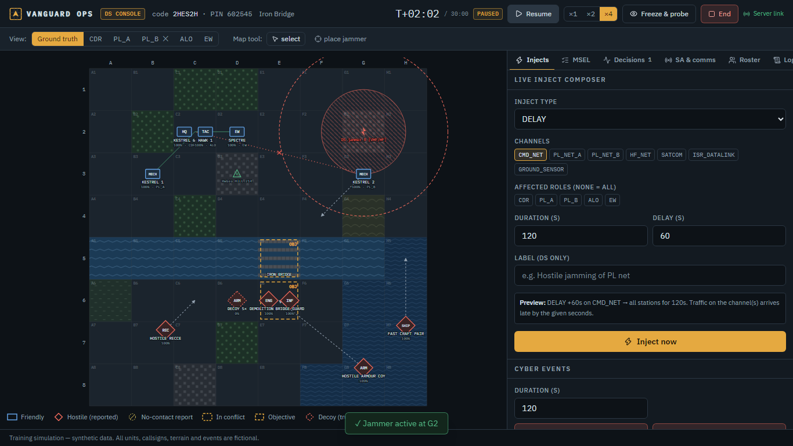

---

## Why

Contemporary conflicts have shown that electronic warfare and cyber disruption degrade communications and situational awareness at exactly the moment junior and mid-level commanders must decide. EW-saturated fighting in Ukraine, the multi-domain character of Operation Sindoor (ground intelligence, cyber and EW feeding joint targeting) and the Indian Army's push towards structured wargaming (WARDEC, Feb 2026) all point the same way: officers need to rehearse **deciding under fog**, not under perfect information. TEWTs and CPXs largely assume complete, reliable information flow. VANGUARD OPS makes the fog the training objective — with nothing but public, fictional, synthetic content.

## What it does

| | |
|---|---|
| **Separation of realities** | The server holds ground truth. Each role (CDR, two platoon commanders, Air Liaison/ISR, EW/Signals, optional Naval Liaison) receives only its own **perceived picture** — ground truth through a 6-step degradation pipeline. An automated test proves no truth field ever reaches a trainee socket. |
| **Degradation that comes from the scenario** | DS places EW jammers (position, radius, bands, power) and the effect on each link is **computed from geometry and band** (inner 50 % denied, outer 50 % heavy delay + 40 % drop), plus ridge line-of-sight, relays, frequency hopping, C2 outage, datalink compromise and GPS spoofing. Seven manual inject types remain as overrides. |
| **Mission command** | When every radio/data path to the superior is denied: **“CUT OFF — act on intent.”** Decisions made then are scored for adherence to the commander's intent. |
| **SAGAT freeze probes** | DS freezes the exercise; screens blank; each role answers auto-generated questions scored against ground truth → per-role SA accuracy and a team **SA-divergence heatmap**. |
| **Confidence calibration** | Every decision carries a confidence (0–100) → Brier score and over-confidence per role. |
| **Hindsight-safe AAR** | Decision cards freeze what was knowable (intel, ages, conflicts, outages) and reveal ground truth only on demand. Four AAR questions, swimlane timeline, network graph, replay scrubber, **PDF / JSON / CSV** export. |
| **Optional AI (Smart Automation)** | `LLM_PROVIDER=none\|ollama\|anthropic` — narrative and coaching drafts, contradictory report pairs. Off by default; every feature works on templates. |

## PS requirement → feature mapping

| PS expected outcome | Where it is |
|---|---|
| 1. Scenario engine injecting delay, dropout, conflicting reports mid-exercise | `packages/sim` degradation pipeline + EW/terrain/cyber models; DS inject composer, jammer tool, cyber controls, MSEL timeline (15 scripted injects per scenario) |
| 2. Multiplayer team coordination under degraded information | Server-authoritative Socket.IO, one room per role; player-to-player messages, forwarding and intent updates travel through the same degradation; PACE switching; real cross-machine play (E2E uses 4 separate browser contexts) |
| 3. Instructor dashboard to configure variables and monitor decisions live | DS console: god view, **view-as-role**, injects, jammers, cyber, MSEL, live decision feed with SOUND/RISKY/UNSOUND, SAGAT probe, SA heatmap, comms health, roster |
| 4. Exportable AAR with individual and team timelines and rationale | AAR page + server-generated **PDF**, JSON event log, decisions CSV; swimlanes per role, decision cards with rationale, confidence, metrics |

Full traceability, acceptance criteria and formulas: [`docs/PRD.md`](docs/PRD.md).

## Screenshots

| | |
|---|---|
| 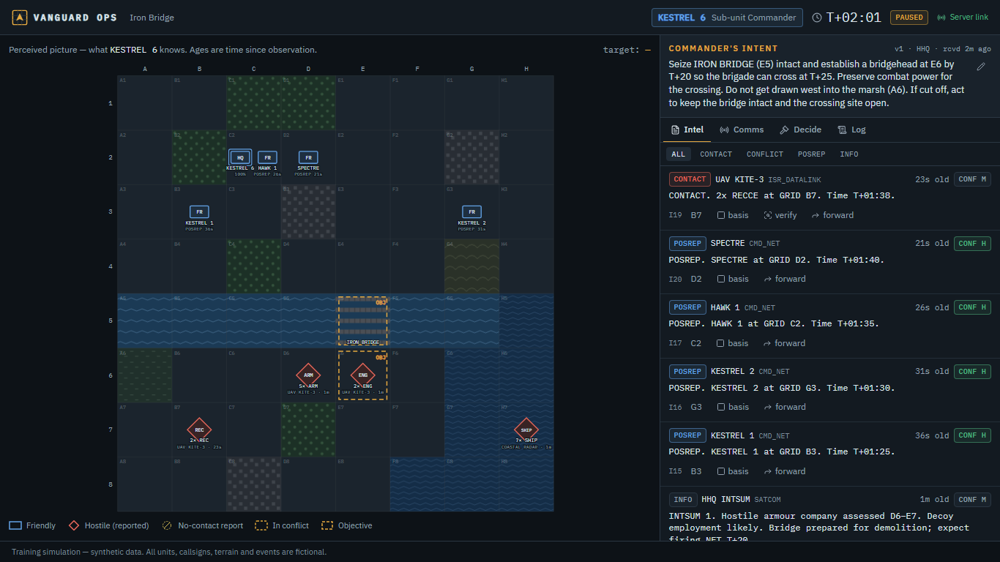 CDR's perceived picture: contacts with source, age and confidence | 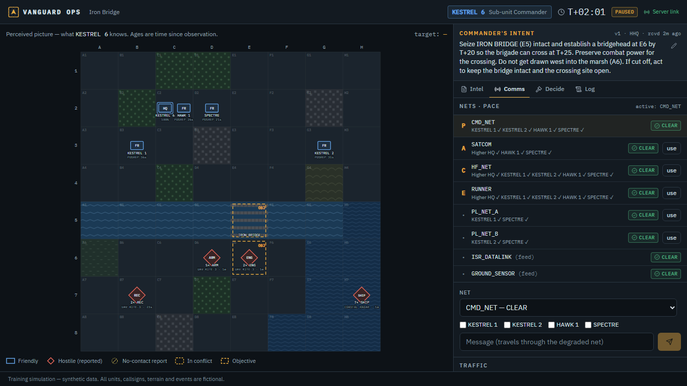 PACE plan with live link state per net |
| 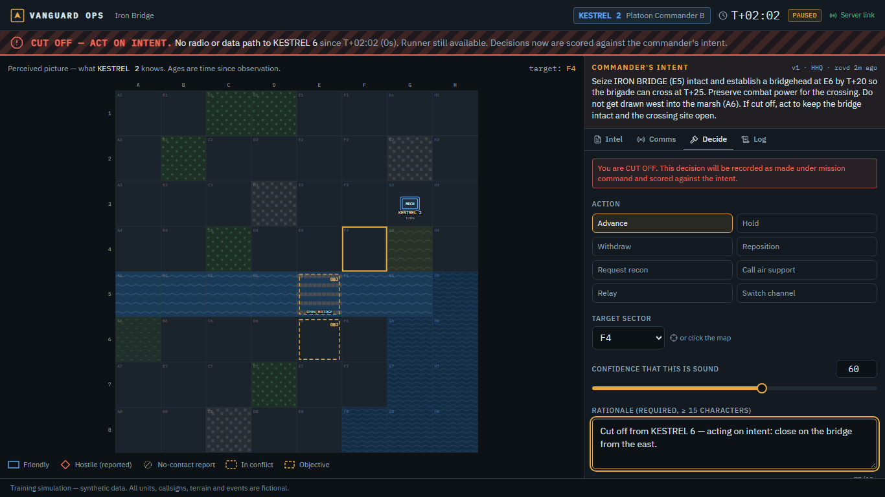 PL B cut off by a jammer, deciding on intent | 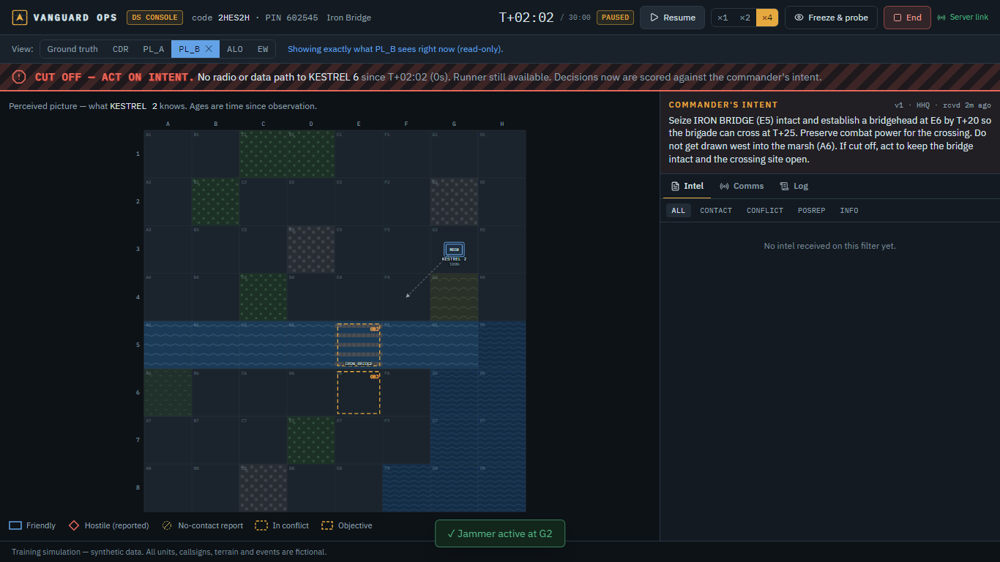 DS “view as PL_B” — exactly the trainee's screen |
| 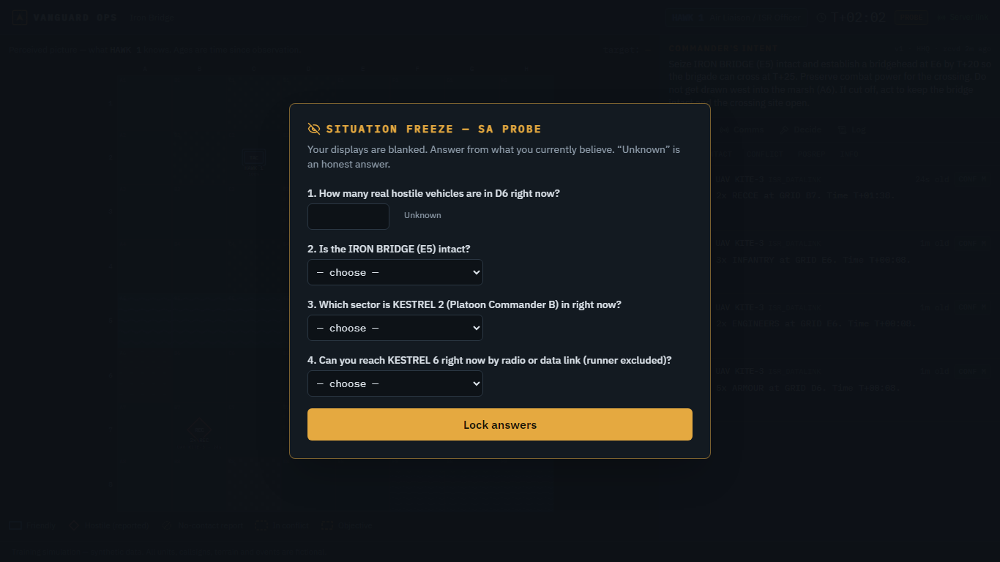 SAGAT freeze — picture blanked, answer from memory | 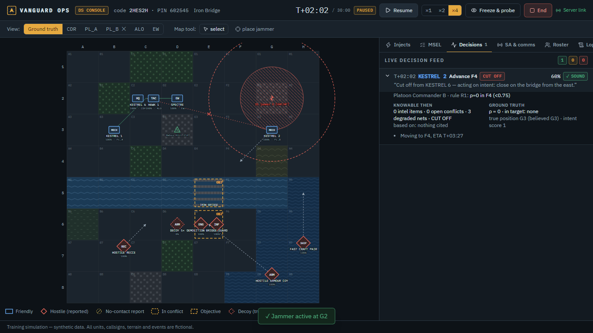 Live decision feed: knowable vs truth |
| 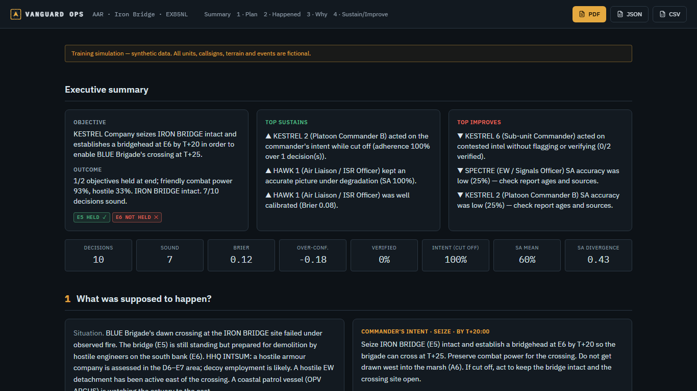 AAR executive summary | 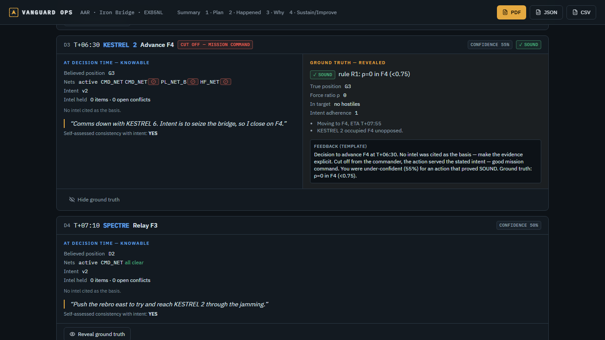 Hindsight-safe decision card, truth revealed |
| 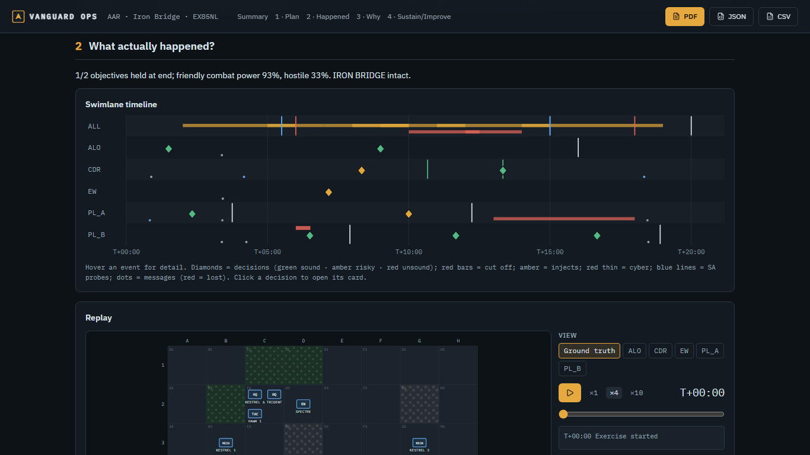 Swimlane timeline + replay | 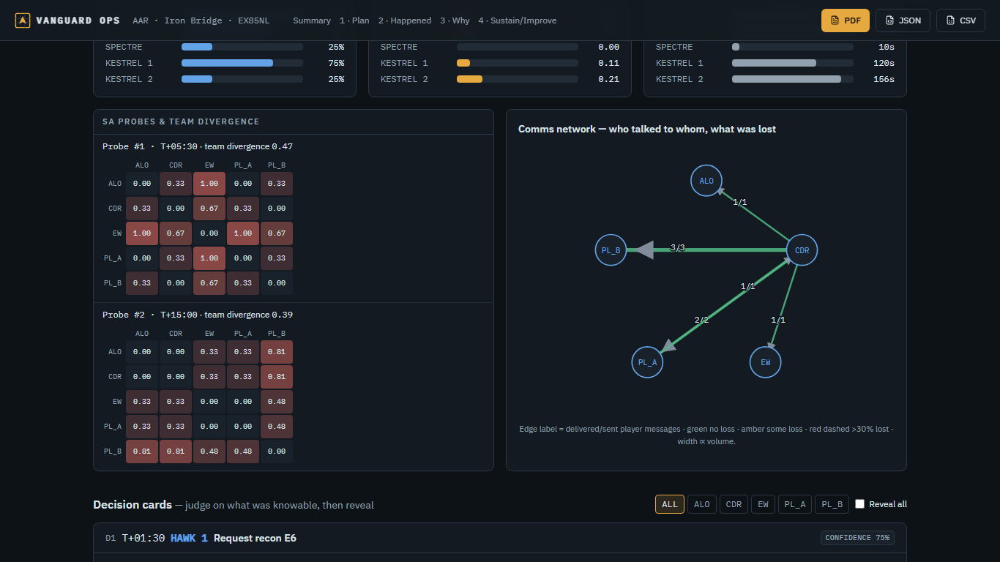 Metrics, SA heatmaps, comms network |

## Architecture

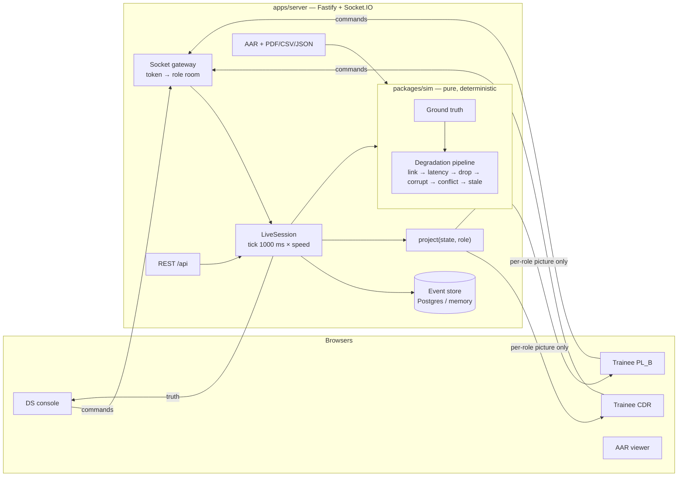

Event-sourced and deterministic: only input events are persisted; seed + log replays to an identical state hash (tested). Details: [`docs/ARCHITECTURE.md`](docs/ARCHITECTURE.md), API: [`docs/API.md`](docs/API.md), decisions: [`docs/DECISIONS.md`](docs/DECISIONS.md).

```
apps/web        React 18 + Vite + Tailwind 4 + Radix (shadcn-style) + Zustand, SVG tactical map
apps/server     Node 20 + Fastify 5 + Socket.IO 4 + Zod + Prisma 6 (Postgres) + pdfkit
packages/sim    pure deterministic simulation + degradation engine (99 % line coverage)
packages/shared Zod schemas, events, commands, DTOs
scenarios/      Iron Bridge (joint, riverine) · Ridge Line (mountain) — JSON, validated at start-up
e2e/            Playwright: DS + 3 trainees, accessibility (axe)
```

## Quick start

**Prerequisites:** Node ≥ 20, pnpm 9 (`npm i -g pnpm@9`). Docker optional.

```bash
pnpm install
```

```bash
pnpm dev
```

Open http://localhost:5173 → *Create exercise* in one browser, *Join exercise* in others (other machines on the LAN can join via your IP; use the DS's session code). With no `DATABASE_URL` the server uses an in-memory store.

```bash
pnpm check
```

runs lint + typecheck + 145 unit/integration tests (including the ground-truth leak test). End-to-end:

```bash
pnpm e2e:full
```

### Docker (fully offline once images are built)

```bash
docker compose up --build
```

App + PostgreSQL on http://localhost:8080; a finished demo exercise is seeded on first boot. Optional local LLM: `docker compose --profile ai up` with `LLM_PROVIDER=ollama`. Another demo exercise any time:

```bash
docker compose exec app node server/dist/seed-demo.js
```

### Configuration

See [`.env.example`](.env.example): `PORT`, `TICK_HZ`, `DATABASE_URL`, `SEED_DEMO_ON_EMPTY`, `LLM_PROVIDER` (`none`|`ollama`|`anthropic`), `OLLAMA_URL`, `OLLAMA_MODEL`, `ANTHROPIC_API_KEY`, `ANTHROPIC_MODEL` (default `claude-opus-5-5`).

## Deploy

**Render (Blueprint):** the repo contains [`render.yaml`](render.yaml) — one Docker web service (WebSockets supported) + Render Postgres, `/healthz` health check, migrations on start, demo seeded on an empty DB.

1. https://dashboard.render.com → **New → Blueprint**.
2. Connect GitHub and select **harshit-1243/vanguard-ops-sih26248** → branch `main`.
3. Render shows `vanguard-ops` (web) and `vanguard-db` (Postgres). Leave `ANTHROPIC_API_KEY` empty (AI stays off) → **Apply**.
4. Wait for the deploy to go live (first Docker build ≈ 5–8 min), then open the `.onrender.com` URL.

Smoke test any deployment:

```bash
pnpm --filter @vanguard/server smoke https://YOUR-APP.onrender.com
```

Free-tier notes: the web service sleeps after ~15 min idle (first request wakes it in ~1 min); free Render Postgres expires after 30 days. Fallbacks: Railway / Fly.io run the same Dockerfile.

## Safety & data

- 100 % synthetic, fictional content; disclaimers in the footer, AAR and every PDF page.
- Ground truth is isolated server-side; trainees only receive `project()` output (leak-tested in CI).
- Minimal auth: session code + per-tab tokens (hashed server-side), PIN login rate-limited; no passwords or PII beyond a callsign.
- No secrets in the repo; AI disabled by default.

## Team

| Name | Role |
|---|---|
| _TBD_ | Team lead |
| _TBD_ | Simulation & backend |
| _TBD_ | Frontend & UX |
| _TBD_ | Domain / DS liaison |

Demo script: [`docs/DEMO_SCRIPT.md`](docs/DEMO_SCRIPT.md) · Pitch notes: [`docs/PITCH_NOTES.md`](docs/PITCH_NOTES.md) · Status: [`docs/PROGRESS.md`](docs/PROGRESS.md)
