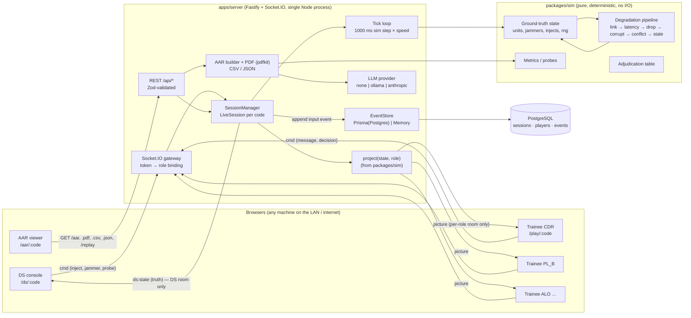
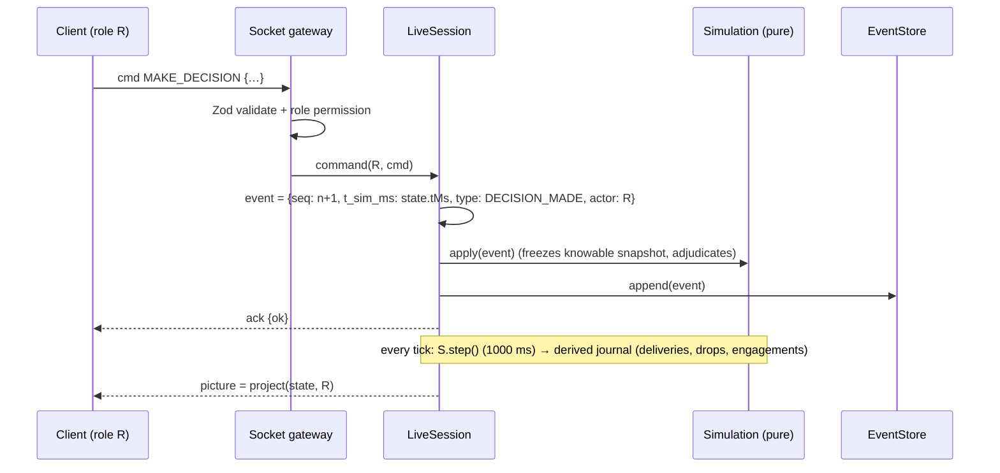

# Architecture

## 1. System view

**Separation of realities.** Ground truth exists only inside `LiveSession.sim.state` on the server.
The only function that turns state into a trainee payload is `project(state, scenario, roleId)`.
Trainee sockets are placed in exactly one room, `s:<code>:role:<roleId>`, decided by the server from
the player token — never by anything the client sends.

## 2. Event sourcing & determinism

- **Inputs** (commands → events) are the only persisted facts. Everything else — report generation,
  message deliveries/drops, link changes, cut-offs, engagements — is *derived* by `step()` and written
  to `state.journal`, which is re-derived identically on replay.
- `step()` always advances exactly 1000 ms of sim time. Speed only changes how often the server calls it.
- All randomness: `state.rng` (mulberry32 state, a uint32 in the state object). No `Math.random`,
  no `Date.now` inside `packages/sim`.
- Iteration order: arrays sorted by id where order matters; no reliance on object key order of
  dynamic maps.
- `hashState()` (FNV-1a of canonical JSON) is used by the determinism test and the replay endpoint.

## 3. Packages

| Package | Responsibility | Depends on |
|---|---|---|
| `packages/shared` | Zod schemas (scenario, commands, DTOs), grid helpers, report text formatting, types for `PerceivedPicture`, `InstructorState`, `AarReport` | zod |
| `packages/sim` | `Simulation` (state + `apply` + `step`), PRNG, geometry/LOS, link model, pipeline, EW/cyber, sensors, projection, adjudication, probes, metrics, AAR builder, replay | shared |
| `apps/server` | HTTP/WS, session lifecycle, tick loop, auth tokens, persistence, PDF/CSV/JSON export, LLM adapters, scenario loading | shared, sim |
| `apps/web` | Landing, join, trainee console, DS console, AAR viewer; SVG tactical map; Zustand stores | shared |

## 4. Runtime topology

- One Node process serves REST, WebSockets and the built SPA (`apps/web/dist`) — one Docker image.
- Sessions live in memory (`SessionManager`) and are persisted as an append-only event log. On boot,
  non-ended sessions are rebuilt by replay (paused) so a restart loses nothing.
- Horizontal scaling is out of scope for v1 (a DSSC exercise is ≤ 7 clients per session). Sticky
  sessions + per-session ownership would be the path if needed.

## 5. WebXR readiness

A future WebXR "3D sand-model" client needs no server change: it authenticates with a session token,
subscribes to `picture` / `ds:state`, and renders `terrain` (8×8 codes → elevation class) plus units
in grid coordinates. All payloads are plain JSON with cell coordinates, independent of the 2D SVG renderer.
